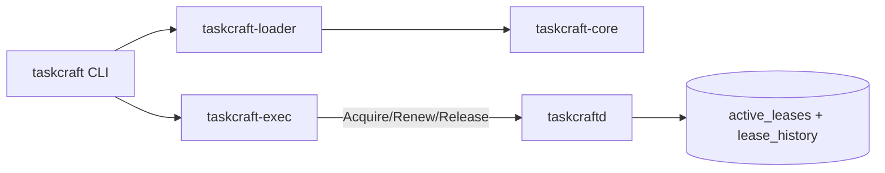

# Taskcraft Architecture

## System Boundaries

Taskcraft has five runtime boundaries:

1. CLI boundary (`taskcraft`): user intent, command dispatch, text output contracts.
2. Loader boundary (`taskcraft-loader`): recursive module discovery and graph materialization.
3. Core boundary (`taskcraft-core`): shared domain model + label + DAG logic.
4. Executor boundary (`taskcraft-exec`): ordered runtime execution and retry/timeout behavior.
5. Daemon boundary (`taskcraftd`): lease coordination and persistence.

## Component Diagram

## End-to-End Lifecycle

1. CLI parses command and resolves workspace cwd.
2. Loader discovers all `TASKS.py` (gitignore-aware walk).
3. Loader evaluates each file via Monty and converts objects to strict JSON.
4. Loader merges all modules into one `WorkspaceSpec`, resolves labels/defaults/scopes.
5. Core planner validates dependency graph and computes topological order.
6. Executor runs targets and transitive dependencies.
7. If tasks define `needs`, executor acquires and releases daemon leases around attempts.
8. Daemon updates in-memory usage and SQLite state/history.

## Data Contracts

- Labels
  - absolute: `//package:task`
  - relative: `:task` (resolved against current package)
- WorkspaceSpec
  - single merged graph of tasks, queues, limiters
- Daemon protocol
  - line-delimited JSON request/response frames over unix socket
  - request variants: `AcquireLease`, `RenewLease`, `ReleaseLease`, `Status`
- Execution summary
  - per-task result: success/failure, attempts, exit code

## Consistency and Safety Rules

- Dependency graph must be acyclic.
- Missing dependency labels fail before execution.
- Lease acquisition is all-or-none per request.
- Pending requests are queued when capacity is exhausted.
- Expired leases are reclaimed and recorded.
- SQLite restart recovery restores only non-expired active leases.

## Failure Surfaces

- Loader failures
  - invalid/malformed `TASKS.py`
  - invalid labels
  - unsupported Monty object conversion
  - unknown dependency references
- Executor failures
  - step exit non-zero
  - timeout
  - retry exhaustion
  - daemon RPC errors for lease operations
- Daemon failures
  - invalid lease request shape
  - unknown lease on renew/release
  - sqlite schema/open/write failures

## Persistence Model

SQLite tables:

- `active_leases`
  - authoritative restart snapshot of currently granted leases
- `lease_history`
  - append-only audit events (`acquire`, `renew`, `release`, `expire`)

Recovery behavior:

- daemon startup creates schema if needed
- daemon loads active rows, discards expired, rebuilds usage totals

## Operational Contracts

- Human entrypoint: `taskcraft`
- Daemon entrypoint: `taskcraft daemon start`
- Default check gate: `make check`
- Docs contract gate:
  - `cargo test --workspace --doc`
  - `cargo test -p taskcraft --test doctest_contract`

## Navigation

- CLI contract details: [`crates/taskcraft/ARCHITECTURE.md`](crates/taskcraft/ARCHITECTURE.md)
- Core model + algorithms: [`crates/taskcraft-core/ARCHITECTURE.md`](crates/taskcraft-core/ARCHITECTURE.md)
- Loader pipeline: [`crates/taskcraft-loader/ARCHITECTURE.md`](crates/taskcraft-loader/ARCHITECTURE.md)
- Execution semantics: [`crates/taskcraft-exec/ARCHITECTURE.md`](crates/taskcraft-exec/ARCHITECTURE.md)
- Daemon/persistence protocol: [`crates/taskcraftd/ARCHITECTURE.md`](crates/taskcraftd/ARCHITECTURE.md)
