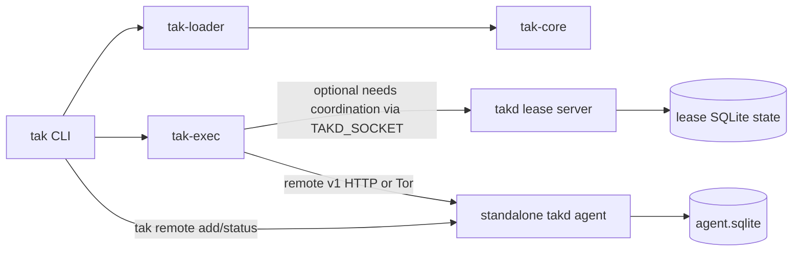

# Tak Architecture

Tak is a project-local task orchestrator. Every workspace starts from the current directory
`TASKS.py`, can expand only through explicit `module_spec(includes=[...])` links, and ends as one
validated dependency graph that `tak` executes locally or on remote `takd` agents.

This document describes the shipped system shape. Crate-level architecture docs carry the lower
level implementation details.

## Runtime Boundaries

Tak is organized around five runtime boundaries:

1. CLI boundary (`tak`)
   - parses user intent, renders output, and owns local/remote command contracts
2. Loader boundary (`tak-loader`)
   - resolves the current directory workspace and builds one validated `WorkspaceSpec`
3. Core boundary (`tak-core`)
   - shared label/model/planner logic with no IO
4. Execution boundary (`tak-exec`)
   - runs tasks, enforces retries/timeouts, chooses local vs remote placement, and stages remote context
5. Agent/runtime boundary (`takd`)
   - hosts the standalone execution agent plus the reusable lease and remote-server runtimes

The `takd` crate contains two related server-side capabilities:

- standalone agent service used by `takd init`, `takd serve`, `takd status`, `takd logs`, and
  `takd token show`
- reusable lease and remote server internals used by tests and integrated runtimes

`tak` itself does not currently manage local daemon lifecycle. `tak status` remains an unsupported
placeholder in the current client-only build.

For remote onboarding, `tak` now accepts either the raw `takd` invite/token string or the Tor-v3
word phrase emitted by `takd token show --words`. The phrase encodes the onion host directly and
includes a checksum word so typo rejection happens locally before probing the remote node.

## Runtime Topology

## Workspace Load and Graph Construction

All workspace-aware `tak` commands (`list`, `tree`, `explain`, `graph`, `web`, `run`) follow the
same front half of the system:

1. resolve the current directory
2. require a local `TASKS.py`
3. follow only explicit `module_spec(includes=[...])` links
4. evaluate each module with the DSL prelude
5. convert runtime values into strict schema-backed structures
6. merge tasks, queues, limiters, defaults, and scope keys into one `WorkspaceSpec`
7. validate label references, unknown dependencies, and DAG acyclicity before any execution

Important loader rules:

- workspace scope never widens implicitly to parents or child directories
- includes are explicit and relative to the including module
- all merged task labels are canonical before execution
- duplicate definitions fail during merge, not during task execution

## Execution and Placement Flow

`tak run` is the main execution path:

1. parse labels from CLI input
2. reject path-like inputs such as `.` or `./task`
3. expand the transitive dependency closure
4. topologically sort the required graph
5. execute each task attempt with retry and timeout policy
6. choose local or remote placement for each task

Local execution behavior:

- command and script steps run with explicit `cwd` and `env` controls
- task `stdout` and `stderr` stream directly to the local CLI while the step is running
- retry policies apply around whole task attempts
- task timeouts terminate slow work
- `needs` coordination is optional and only activates when `TAKD_SOCKET` points at a unix socket

When `needs` coordination is active, `tak-exec` talks to the `takd` lease runtime over a unix
socket using request/response messages such as `AcquireLease`, `RenewLease`, `ReleaseLease`, and
`Status`.

Remote execution behavior:

1. choose a remote node from client inventory
2. probe node identity and protocol compatibility through `/v1/node/info`
3. stage the normalized workspace context and task payload
4. submit work over remote v1 HTTP, either directly or through Tor
5. stream stdout/stderr events, fetch terminal result payloads, and materialize returned outputs/artifacts
6. print run summary metadata such as `placement`, `remote_node`, `transport`, `reason`,
   `context_hash`, `runtime`, and `runtime_engine`

## Agent and Remote Model

The standalone remote worker flow is centered on the `takd` binary:

1. `takd init`
   - writes agent config/state roots and initial transport settings
2. `takd serve`
   - starts the standalone agent service
   - serves remote v1 HTTP endpoints
   - advertises a direct base URL or Tor onion endpoint when ready
3. `tak remote add <token>`
   - imports an onboarding token into the local client inventory after probing the node
4. `tak remote status`
   - fetches `/v1/node/status` from configured agents and renders active jobs plus resource usage

The current user-facing remote agent commands are:

- `tak remote add <token>`
- `tak remote list`
- `tak remote remove`
- `tak remote status`
- `takd init`
- `takd serve`
- `takd status`
- `takd logs`
- `takd token show`

## Protocol Surfaces

Tak uses two distinct protocol families.

| Surface | Transport | Used By | Primary Shape |
|---|---|---|---|
| Lease coordination | unix socket | `tak-exec` when `TAKD_SOCKET` is set | line-delimited request/response messages for lease acquire, renew, release, and status |
| Remote agent control/status | remote v1 HTTP | `tak remote add <token>`, `tak remote status`, `takd serve` | authenticated `/v1/node/info` and `/v1/node/status` requests |
| Remote task execution | remote v1 HTTP | `tak-exec` remote placement path | submit, events, result, and cancel flows for task runs and artifact roundtrip |

The remote agent surface is transport-agnostic at the CLI level:

- direct transport uses ordinary HTTP listeners
- Tor transport uses an onion endpoint but keeps the same remote v1 HTTP contract

## Persistence and Runtime State

Tak keeps the loaded workspace graph in memory. Persistent runtime state lives in `takd`.

Lease runtime persistence:

- SQLite tables such as `active_leases` and `lease_history`
- restart recovery rebuilds live limiter usage from non-expired rows

Remote agent persistence:

- `agent.sqlite` for remote submit attempts, streamed events, and terminal results
- config/state roots created by `takd init`
- ready base URL or onion advertisement persisted for later `takd status` and token reads

## Invariants and Failure Surfaces

System invariants:

- the current directory is the only implicit workspace root
- `TASKS.py` loading is explicit and bounded by includes
- dependency graphs must validate before execution begins
- labels are normalized before lookup and scheduling
- lease coordination is optional, but when enabled it is all-or-none per request
- remote execution requires a reachable, authenticated remote node

Common failure classes:

- missing or invalid `TASKS.py`
- include-cycle or duplicate-definition errors
- unknown dependency labels or DAG cycles
- step launch failures, non-zero exits, retry exhaustion, or timeouts
- lease transport/protocol failures on the unix socket path
- remote probe/auth/connectivity failures on the remote v1 HTTP path
- remote result or artifact materialization failures

## Navigation

- CLI contract details: [`crates/tak/ARCHITECTURE.md`](crates/tak/ARCHITECTURE.md)
- Core model + algorithms: [`crates/tak-core/ARCHITECTURE.md`](crates/tak-core/ARCHITECTURE.md)
- Loader pipeline: [`crates/tak-loader/ARCHITECTURE.md`](crates/tak-loader/ARCHITECTURE.md)
- Execution semantics: [`crates/tak-exec/ARCHITECTURE.md`](crates/tak-exec/ARCHITECTURE.md)
- Agent and daemon internals: [`crates/takd/ARCHITECTURE.md`](crates/takd/ARCHITECTURE.md)
