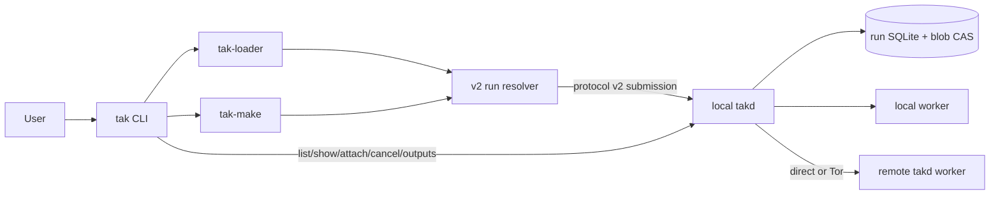

# Tak Architecture

Tak is a project-local task orchestrator with a short-lived authoring client and a durable
execution daemon. A `TASKS.py` workspace starts in the current directory, expands only through
explicit `module_spec(includes=[...])` links, and uses authoring schema v2. Makefile mode adapts one
opaque goal, or an explicitly annotated parallel group, into the same daemon-owned run model.

## Ownership boundary

The boundary is deliberately asymmetric:

- Tak resolves Python policies, task labels, dependency closure, authored defaults, environment
  allowlists, and concrete placement candidates.
- takd owns scheduling, execution, retries, cancellation, artifacts, and events after it accepts a
  run.
- takd owns direct and Tor inventory, live capacity checks, final node placement, worker fencing,
  and durable run state.

`tak run`, `tak make`, `tak exec`, and `tak docker run` never execute work in the client. They
require the local `takd serve` socket and have no legacy executor or protocol fallback. Read-only
workspace commands such as `tak list`, `tak explain`, and `tak graph` still run without a daemon.

## Runtime topology

```mermaid
flowchart LR
    User --> Client[tak CLI]
    Client --> Loader[tak-loader]
    Client --> Make[tak-make]
    Loader --> Resolve[v2 run resolver]
    Make --> Resolve
    Resolve -->|protocol v2 submission| Daemon[local takd]
    Daemon --> Store[(run SQLite + blob CAS)]
    Daemon --> Local[local worker]
    Daemon -->|direct or Tor| Remote[remote takd worker]
    Client -->|list/show/attach/cancel/outputs| Daemon
```

The client does not start or supervise daemon lifecycle. A missing socket is an actionable error
that names the socket and tells the operator to start `takd serve`.

## Authoring and resolution

Every root and included `TASKS.py` module declares `module_spec(spec_version=2, ...)`. The loader:

1. fixes the current directory as the workspace root;
2. evaluates only the root and explicitly included modules with the bounded DSL runtime;
3. converts values into strict v2 domain objects;
4. canonicalizes labels and validates dependencies and cycles;
5. evaluates Python placement policies in the client; and
6. resolves the selected graph, contexts, sessions, candidates, outputs, and environment names into
   one immutable submission.

The submitted environment contains only names declared with `pass_env` or `--pass-env`. Secret
values are carried in the submission envelope, not persisted in the authored graph or rendered in
debug output.

## Daemon run lifecycle

takd validates and persists a submission before scheduling it. Its scheduler owns limiter and
queue admission, node capacity, affinity, retry timing, unknown-attempt fencing, cancellation, and
terminal propagation. Local host, local container, direct remote, and Tor remote attempts all use
that path.

Events and state are durable, so a client disconnect is not a cancellation signal. The initial
command and `tak runs attach RUN_ID` consume the same ordered event stream. The first Ctrl-C asks
takd to persist cancellation; a second may detach while cancellation continues. Operators recover
with `tak runs list`, `show`, `attach`, `cancel`, and `outputs`.

## Placement and sessions

Tak supplies policy and concrete candidates; takd selects from candidates using live state:

- `Balanced` is the default and scores projected resource/queue pressure with bounded locality
  credit.
- `RoundRobin` advances a cursor stored by the daemon.
- `Sequential` preserves candidate order.

Session semantics are part of the submitted scheduling contract:

- `Workspace` is an isolated snapshot per job.
- `Paths` is a private selected-path CAS cache.
- `SharedWorkspace(max_parallel_tasks=N)` shares mutable state on a hard-affinity node.
- `Container` fuses a cascaded task group into one job/container.

Soft affinity is a preference; hard affinity restricts eligible nodes. Shared workspace reuse
requires `RequireSameNode` and cannot be weakened by a task override.

## Outputs and persistence

Workers publish only declared outputs. takd validates producer identity and canonical paths before
committing artifacts. A successful attachment may materialize them into the original checkout only
after a snapshot conflict check; any conflict copies nothing. `tak runs outputs RUN_ID --to DIR`
instead creates a fresh explicit destination and does not use the checkout association.

The run store persists submissions, jobs, attempts, scheduling transitions, output events,
cancellation, artifact manifests, and content-addressed blobs. Default maintenance expires terminal
payloads after 7 days, retains terminal metadata for 30 days, and bounds workspace/path blobs to a
20 GiB cache budget.

## Protocols and upgrades

The local unix-socket protocol v2 covers submit, attach, get, list, cancel, output manifest, and
output chunk operations. Remote worker protocol v2 covers probe, dispatch, observe, acknowledge,
cancel, and artifact retrieval over direct or Tor transport. Request identity, attempt generation,
and fencing tokens prevent stale workers from committing late state.

The v2 authoring schema and both protocol surfaces ship as a coordinated release. Version mismatch
diagnostics require upgrading `tak`, `takd`, and workers together; no v1 fallback is attempted.

## Security model

- The Tor invite/address is a secret, not just a location.
- Anyone with it can submit jobs and read outputs/logs.
- Do not paste it into shared chats, issue trackers, screenshots, or logs.
- Rotate the onion address if exposed.
- Tak remote does not provide multi-user isolation.

## Crate map

- `tak-core`: v2 authored/resolved domain types, labels, validation, and deterministic algorithms.
- `tak-loader`: bounded `TASKS.py` evaluation and explicit include resolution.
- `tak-make`: Makefile annotation and goal adapter.
- `tak`: CLI resolution, submission, persisted-event UI, and safe output materialization.
- `takd`: durable scheduler, local/remote attempt coordination, inventory, run store, and artifacts.
- `tak-runner` / `tak-exec`: execution primitives used behind daemon worker boundaries.

See [Daemon-Owned Runs and TASKS.py v2](docs/daemon-runs-v2.md) for the user-facing lifecycle and
migration guide.
