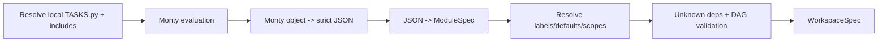

# tak-loader Architecture

## Purpose

`tak-loader` transforms the current directory `TASKS.py` plus its explicit include graph into one validated `WorkspaceSpec`.

It is responsible for discovery, evaluation, conversion, merge, and graph-level validation before execution begins.

## Pipeline

## Responsibilities

- Resolve the current directory `TASKS.py`.
- Discover only explicitly included `TASKS.py` files.
- Execute each file with DSL prelude under bounded Monty limits.
- Convert Monty values into strict JSON-compatible structures.
- Deserialize into `ModuleSpec` and merge into global registries.
- Resolve limiter scope keys and task labels.
- Validate dependencies and acyclic graph property.

## Key Contracts

- Every merged task label is absolute and unique.
- Workspace scope never expands implicitly beyond the current directory root.
- Includes are resolved relative to the including module and must stay under the workspace root.
- Dependencies must reference existing tasks.
- Module defaults apply consistently when task-local values are absent.
- Scope keys are derived from scope type (`machine/user/project/worktree`).

## Failure Classes

- missing `TASKS.py` in the current directory
- include resolution or include-cycle errors
- syntax/runtime/type-checking failures during Monty eval
- object conversion failures for unsupported runtime values
- parse failures for module schema
- duplicate/conflicting definitions
- unknown dependencies or cycles

## Main Functions

- `detect_workspace_root`
- `discover_tasks_files`
- `load_workspace`
- `eval_module_spec`
- `merge_module`

## Main Files

- `src/lib.rs`: end-to-end loader pipeline and merge/validation logic.
