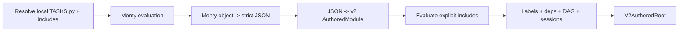

# tak-loader Architecture

## Purpose

`tak-loader` transforms an explicit v2 `TASKS.py` include graph into one validated
`V2AuthoredRoot` for client-side run resolution.

It is responsible for discovery, evaluation, conversion, merge, and graph-level validation before execution begins.

## Pipeline

```mermaid
flowchart LR
    Discover[Resolve local TASKS.py + includes] --> Eval[Monty evaluation]
    Eval --> Convert[Monty object -> strict JSON]
    Convert --> Decode[JSON -> v2 AuthoredModule]
    Decode --> Include[Evaluate explicit includes]
    Include --> Validate[Labels + deps + DAG + sessions]
    Validate --> Root[V2AuthoredRoot]
```

## Responsibilities

- Resolve the current directory `TASKS.py`.
- Discover only explicitly included `TASKS.py` files.
- Execute each file with DSL prelude under bounded Monty limits.
- Convert Monty values into strict JSON-compatible structures.
- Require literal `module_spec(spec_version=2, ...)` in every root and included module.
- Deserialize into strict v2 authored domain values and merge explicit includes.
- Evaluate Python placement policies in the client before daemon submission.
- Resolve limiter scope keys and task labels.
- Validate dependencies and acyclic graph property.

## Key Contracts

- Every merged task label is absolute and unique.
- Workspace scope never expands implicitly beyond the current directory root.
- Includes are resolved relative to the including module and must stay under the workspace root.
- Dependencies must reference existing tasks.
- Module defaults apply consistently when task-local values are absent.
- Ambient environment names are explicit through `pass_env`.
- Scope keys are derived from scope type (`machine/user/project/worktree`).
- Container CPU and memory resources are optional. When present, both values must come from the
  typed `Container.Resources(...)` DSL value; omission means no implicit container limit or remote
  admission reservation.

## Failure Classes

- missing `TASKS.py` in the current directory
- include resolution or include-cycle errors
- syntax/runtime/type-checking failures during Monty eval
- object conversion failures for unsupported runtime values
- parse failures for module schema
- duplicate/conflicting definitions
- unknown dependencies or cycles

## Main Functions

- `detect_workspace_root`
- `discover_tasks_files`
- `load_workspace`
- `inspect_authored_root_module`

## Main Files

- `src/loader/v2_includes.rs`: explicit v2 include discovery and merge.
- `src/loader/v2_wire_conversion.rs`: strict wire-to-domain conversion.
