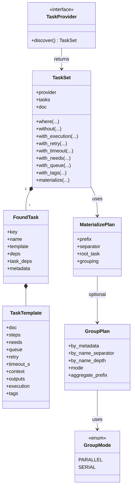

# Class Diagram

## Explanation

- [[TaskProvider]] is the entry point. Its only required method is [[TaskProvider.discover]].
- [[TaskProvider.discover]] returns one [[TaskSet]].
- [[TaskSet]] contains many [[FoundTask]] values.
- Each [[FoundTask]] owns one [[TaskTemplate]].
- [[TaskSet.materialize]] consumes one [[MaterializePlan]].
- [[MaterializePlan]] can optionally use one [[GroupPlan]], which in turn uses [[GroupMode]].

## Related symbols

- [[TaskProvider]]
- [[TaskTemplate]]
- [[FoundTask]]
- [[TaskSet]]
- [[GroupPlan]]
- [[GroupMode]]
- [[MaterializePlan]]
