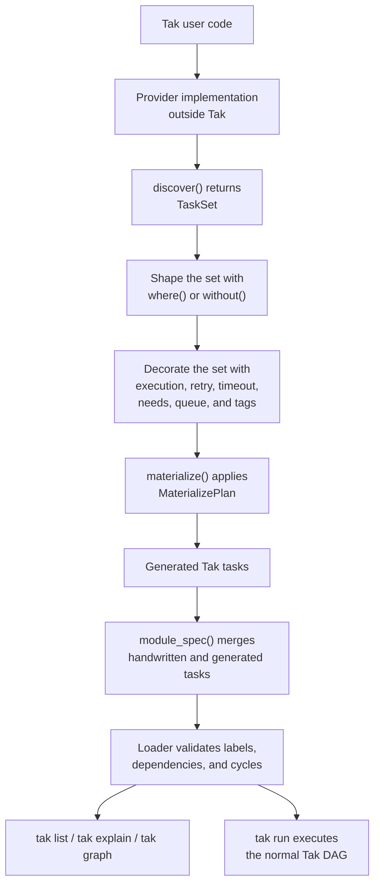

# Execution Diagram

## Explanation

- Discovery happens outside Tak through a provider that satisfies [[TaskProvider]].
- The provider returns a [[TaskSet]] through [[TaskProvider.discover]].
- Selection and decoration happen on that set through methods on [[TaskSet]].
- [[TaskSet.materialize]] lowers the discovered representation into [[Generated Tasks]].
- [[module_spec]] merges generated tasks with handwritten ones before normal validation.
- From that point on, Tak uses its normal graph and execution behavior.

## Related symbols

- [[TaskProvider]]
- [[TaskSet]]
- [[TaskSet.materialize]]
- [[MaterializePlan]]
- [[Generated Tasks]]
- [[module_spec]]
